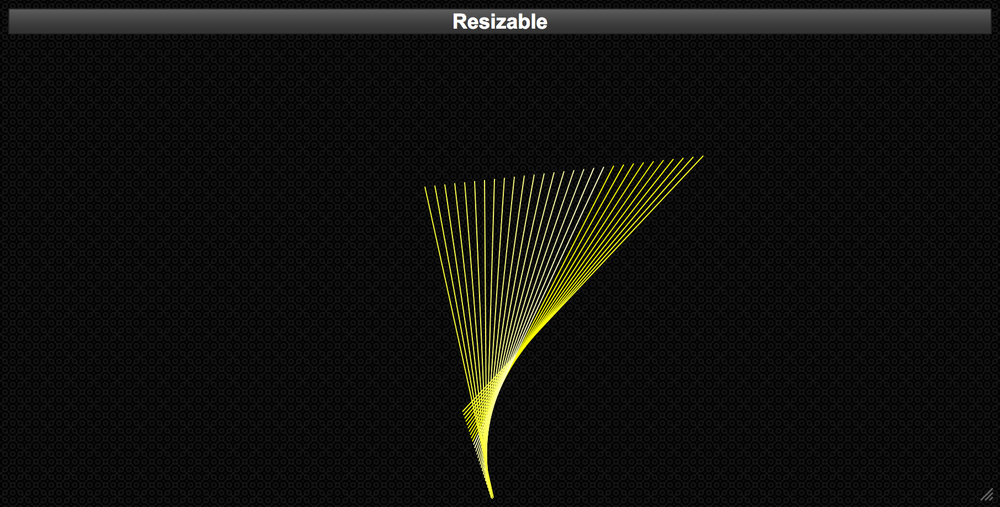

# kinetic-javascript
An animated line inside a resizable box. The movement of the line is beautiful. The interaction between the line and the moving borders of the box is interesting. [See it yourself.](https://www.reimagize.com/kinetic) (Click for a live demo.)

I learned to code in the late 70's. Partly from my hardworking middle school Math teacher Mr. Dobbs but mainly from my father. Dad bought a TRS 80 Model II business computer and it was on this machine that I learned to write programs in the Beginner's All-Purpose Symbolic Instruction Code or [BASIC](https://en.wikipedia.org/wiki/BASIC). I loved everything about it. One of my all-time favorite bits of code dates from that time and draws an animated moving line. Here is the code:

    10 REM THIS IS AN EXAMPLE OF AN ANIMATED MOVING LINE
    20 GOTO40
    30 SAVE"KINETIC/BAS":END
    40 W=4 '  STEP
    50 D=30 ' NUMBER OF BARS
    60 K=2 '  ADD TO RND(W)
    70 FORX=1TO4:Z=RND(W):NEXT
    80 XI=RND(W);XJ=RND(W)
    90 YI-RND(W):YJ=RHD(W)
    100 X=RND(638)
    110 X1=RND(638)
    120 Y=RND(238)
    130 Y1=RND(238)
    140 DIM A(D,4)
    150 I=1:E=2
    160 CLS2
    170 LINE(0,0)-(639,239),1,B
    180 PRINT CHR$(2)
    190 LINE(A(E,1),A(E.2))-(A(E,3),A(E,4)),0:LINE(X,Y)-(XI,Y1)
    200 A(I,1)=X:A(I,2)=Y:A(I,3)=X1:A(I,4)=Y1
    210 I=I+1:IF I>D THEN I=1
    220 E=E+1:IF E>D THEN E=1
    230 IF X+XI<1 OR X+XI>638 THEN XI=-1*SGN(XI)*(RND(W)+K)
    240 IF X1+XJ<1 OR X1+XJ>638 THEN XJ=-1*SGN(XJ)*(RND(W)+K)
    250 IF Y+YI<1 OR Y+YI>238 THEN YI=-l*SGN(YI)*(RND(W)+K)
    260 IF Y1+YJ<1 OR Y1+YJ>238 THEN YJ=-1*SGN(YJ)*(RND(W)+K)
    270 X=X+XI:Y=Y+YI:X1=X1+XJ:Y1=Y1+YJ
    280 GOTO190
This project preserves the behavior of that code in JavaScript and adds an adjustable box to make it interactive.

## Credits

This project makes use of Rick Strahl's [jquery-resizable](https://github.com/RickStrahl/jquery-resizable) project to make the bounding box mobile friendly.

The bounding box and theme was provided by [jQuery UI](https://jqueryui.com/resizable/).

The SVG canvas and line drawing comes from [D3 Data Driven Documents](https://d3js.org/).
